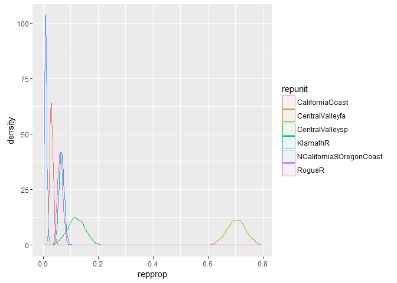

rubias --- a package for bias correction in hierarchical GSI
============================================================
================
09 June, 2017

-   [Input Data](#input-data)
    -   [An example reference data file](#an-example-reference-data-file)
    -   [An example mixture data file](#an-example-mixture-data-file)
-   [Performing a Genetic Mixture Analysis](#performing-a-genetic-mixture-analysis)
    -   [Aggregating collections into reporting units](#aggregating-collections-into-reporting-units)
    -   [Creating posterior density curves from the traces](#creating-posterior-density-curves-from-the-traces)
    -   [Bootstrap-Corrected Reporting Unit Proportions](#bootstrap-corrected-reporting-unit-proportions)
-   [Assessment of Genetic References](#assessment-of-genetic-references)
    -   [Self-assigning fish from the reference](#self-assigning-fish-from-the-reference)
    -   [Simulated mixtures using a leave-one-out type of approach](#simulated-mixtures-using-a-leave-one-out-type-of-approach)
    -   [Specifying mixture proportions in `assess_reference_loo()`](#specifying-mixture-proportions-in-assess_reference_loo)
-   [References](#references)

<!-- README.md is generated from README.Rmd. Please edit that file -->
This is an R package for perorming genetic stock identification (GSI) and associated tasks. Additionally, it includes a method designed to diagnose and correct a bias recently documented in genetic stock identification. The bias occurs when mixture proportion estimates are desired for groups of populations (reporting units) and the number of populations within each reporting unit are uneven.

In order to run C++ implementations of MCMC, rubias requires the package Rcpp, which in turn requires an Rtools installation. After cloning into the repository with the above dependencies installed, build & reload the package to view further documentation.

The script "/R-main/coalescent\_sim" was used to generate coalescent simulations for bias correction validation. This is unnecessary for testing the applicability of our methods to any particular dataset, which should be done using `assess_reference_loo()` and `assess_pb_bias_correction()`. `coalescent_sim()` creates simulated populations using the `ms` coalescent simulation program, available from the Hudson lab at UChicago, and the `GSImulator` and `ms2geno` packages, available at <https://github.com/eriqande>, and so requires more dependencies than the rest of the package.

Input Data
==========

The functions for conducting genetic mixture analysis and for doing simulation assessment to predict the accuracy of a set of genetic markers for genetic stock identification require that genetic data be input as a data frame in a specific format:

-   one row per individual
-   each locus is represented by two adjacent columns, one for each allele (this package is only configured for diploids, at the moment). Allelic types can be expressed as any number or character
-   missing data at a locus is expressed with NA values for each gene copy at the locus
-   if one gene copy is missing in an indivividuals from a locus, then both gene copies must be missing at the locus.
-   the name of the locus is taken to be the column name of the *first* column of each pair of locus columns. The header on the second column is ignored.
-   the data frame must have four columns of meta data for each individual:
    -   `sample_type`: a column telling whether the sample is a `reference` sample or a `mixture` sample.
    -   `repunit`: the reporting unit that an individual/collection belongs to. This is required if sample\_type is `reference`. And if sample\_type is `mixture` then repunit must be `NA`.
        This must be a character vector. Not a factor. The idea of a "reporting unit" is well-known amongst people doing genetic stock identfication of salmon, but might not be familiar elsewhere. Briefly, a reporting unit is a group of populations (which we call "collections") that are typically closely related genetically, and which will likely be aggregrated in the results of the GSI exercise.
    -   `collection`: for reference samples, the name of the population that the individual is from. For mixture samples, this is the name of the particular sample (i.e. stratum or port that is to be treated together in space and time.). This must be a character, not a factor.
    -   `indiv` a character vector with the ID of the fish. These must be unique.
-   When we started developing `rubias`, we intended to allow both the `repunit` and the `collection` columns to be either character vectors or factors. Having them as factors might be desirable if, for example, a certain sort order of the collections or repunits was desired. *However* at some point it became clear to Eric that, given our approach to converting all the data to a C++ data structure of integers, for rapid analyis, we would be exposing ourselves to greater opportunities for bugginess by allowing `repunit` and `collection` to be factors. Accordingly, they **must** be character vectors. If they are not, `rubias` will throw an error. **Note**: if you do have a specific sort order for your collections or repunits, you can always change them into factors after analysis with `rubias`. Additionally, you can keep extra columns in your original data frame (for example `repunit_f` or `collection_f`) in which the repunits or the collections are stored as factors. See, for example the data file `alewife`. Or you can just keep a character vector that has the sort order you would like, so as to use it when changing things to factors after `rubias` analysis. (See, for instance, `chinook_repunit_levels`.)
-   The file can have any number of other meta data columns; however, *they must all occur in the data frame **before** the columns of genetic data*.
-   When you pass a data frame into any of these functions, you have to tell it which column the genetic data starts in, and it is assumed that all the columns after that one contain genetic data.
-   If you are doing a mixture analyis, the data frame of mixture fish and of the reference fish must have the same column structure, i.e., they must have exactly the same number of columns with exactly the same column names, in the same order and of the same type.

An example reference data file
------------------------------

Here are the meta data columns and the first two loci for eight individuals in the `chinook` reference data set that comes with the package:

``` r
library(rubias)
head(chinook[, 1:8])
#> # A tibble: 6 x 8
#>   sample_type         repunit   collection             indiv Ots_94857.232
#>         <chr>           <chr>        <chr>             <chr>         <int>
#> 1   reference CentralValleyfa Feather_H_sp Feather_H_sp:0001             2
#> 2   reference CentralValleyfa Feather_H_sp Feather_H_sp:0002             2
#> 3   reference CentralValleyfa Feather_H_sp Feather_H_sp:0003             2
#> 4   reference CentralValleyfa Feather_H_sp Feather_H_sp:0004             2
#> 5   reference CentralValleyfa Feather_H_sp Feather_H_sp:0005             2
#> 6   reference CentralValleyfa Feather_H_sp Feather_H_sp:0006             2
#> # ... with 3 more variables: Ots_94857.232.1 <int>, Ots_102213.210 <int>,
#> #   Ots_102213.210.1 <int>
```

An example mixture data file
----------------------------

Here is the same for the mixture data frame that goes along with that reference data set:

``` r
head(chinook_mix[, 1:8])
#> # A tibble: 6 x 8
#>   sample_type repunit collection   indiv Ots_94857.232 Ots_94857.232.1
#>         <chr>   <chr>      <chr>   <chr>         <int>           <int>
#> 1     mixture    <NA>       rec2 T124711             4               2
#> 2     mixture    <NA>       rec2 T124719             4               2
#> 3     mixture    <NA>       rec2 T124727             4               4
#> 4     mixture    <NA>       rec1 T124735             4               4
#> 5     mixture    <NA>       rec1 T124743             2               2
#> 6     mixture    <NA>       rec1 T124759             4               2
#> # ... with 2 more variables: Ots_102213.210 <int>, Ots_102213.210.1 <int>
```

Performing a Genetic Mixture Analysis
=====================================

This is done with the `infer_mixture` function. In the example data `chinook_mix` our data consist of fish caught in three different fisheries, `rec1`, `rec2`, and `rec3` as denoted in the collection column. Each of those collections is treated as a separate sample, getting its own mixing proportion estimate. This is how it is run with the default options:

``` r
mix_est <- infer_mixture(reference = chinook, 
                         mixture = chinook_mix, 
                         gen_start_col = 5)
#> Collating data; compiling reference allele frequencies, etc.
#>    time: 2.64 seconds
#> Working on mixture collection: rec2 with 772 individuals
#> calculating log-likelihoods of the mixture individuals.
#>    time: 0.10 seconds
#> performing 100 burn-in and 2000 more sweeps of method "MCMC"
#>    time: 0.62 seconds
#> tidying output into a tibble.
#>    time: 6.84 seconds
#> Working on mixture collection: rec1 with 743 individuals
#> calculating log-likelihoods of the mixture individuals.
#>    time: 0.09 seconds
#> performing 100 burn-in and 2000 more sweeps of method "MCMC"
#>    time: 0.61 seconds
#> tidying output into a tibble.
#>    time: 6.74 seconds
#> Working on mixture collection: rec3 with 741 individuals
#> calculating log-likelihoods of the mixture individuals.
#>    time: 0.09 seconds
#> performing 100 burn-in and 2000 more sweeps of method "MCMC"
#>    time: 0.61 seconds
#> tidying output into a tibble.
#>    time: 6.77 seconds
```

The result comes back as a list of four tidy data frames:

1.  `mixing_proportions`: the mixing proportions. The column `pi` holds the estimated mixing proportion for each collection.
2.  `indiv_posteriors`: this holds, for each individual, the posterior means of group membership in each collection. Column `PofZ` holds those values. It also includes `n_non_miss_loci` and `n_miss_loci` which are the number of observed loci and the number of missing loci at the individual.
3.  `mix_prop_traces:` MCMC traces of the mixing proportions for each collection.
4.  `bootstrapped_proportions`: This is NULL in the above example, but if we had chosen `method = "PB"` then this would be a tibble of bootstrap-corrected reporting unit mixing proportions.

These data frames look like this:

``` r
mix_est
#> $mixing_proportions
#> # A tibble: 207 x 4
#>    mixture_collection         repunit      collection           pi
#>                 <chr>           <chr>           <chr>        <dbl>
#>  1               rec2 CentralValleyfa    Feather_H_sp 8.039951e-02
#>  2               rec2 CentralValleyfa    Feather_H_fa 6.443917e-05
#>  3               rec2 CentralValleyfa     Butte_Cr_fa 3.148164e-05
#>  4               rec2 CentralValleyfa      Mill_Cr_fa 7.518091e-05
#>  5               rec2 CentralValleyfa      Deer_Cr_fa 3.514294e-04
#>  6               rec2 CentralValleyfa  Mokelumne_R_fa 1.511541e-01
#>  7               rec2 CentralValleyfa       Battle_Cr 4.074756e-01
#>  8               rec2 CentralValleyfa Sacramento_R_lf 2.195673e-03
#>  9               rec2 CentralValleysp     Butte_Cr_Sp 1.008511e-02
#> 10               rec2 CentralValleysp      Mill_Cr_sp 6.685205e-02
#> # ... with 197 more rows
#> 
#> $indiv_posteriors
#> # A tibble: 155,664 x 7
#>    mixture_collection   indiv         repunit      collection         PofZ
#>                 <chr>   <chr>           <chr>           <chr>        <dbl>
#>  1               rec2 T124711 CentralValleyfa    Feather_H_sp 1.844615e-28
#>  2               rec2 T124711 CentralValleyfa    Feather_H_fa 4.117472e-33
#>  3               rec2 T124711 CentralValleyfa     Butte_Cr_fa 6.610946e-29
#>  4               rec2 T124711 CentralValleyfa      Mill_Cr_fa 4.270191e-28
#>  5               rec2 T124711 CentralValleyfa      Deer_Cr_fa 1.570599e-29
#>  6               rec2 T124711 CentralValleyfa  Mokelumne_R_fa 9.977711e-28
#>  7               rec2 T124711 CentralValleyfa       Battle_Cr 1.542613e-24
#>  8               rec2 T124711 CentralValleyfa Sacramento_R_lf 4.110865e-29
#>  9               rec2 T124711 CentralValleysp     Butte_Cr_Sp 3.319884e-28
#> 10               rec2 T124711 CentralValleysp      Mill_Cr_sp 1.845840e-27
#> # ... with 155,654 more rows, and 2 more variables: n_non_miss_loci <dbl>,
#> #   n_miss_loci <dbl>
#> 
#> $mix_prop_traces
#> # A tibble: 414,000 x 5
#>    mixture_collection sweep         repunit      collection         pi
#>                 <chr> <int>           <chr>           <chr>      <dbl>
#>  1               rec2     1 CentralValleyfa    Feather_H_sp 0.01449275
#>  2               rec2     1 CentralValleyfa    Feather_H_fa 0.01449275
#>  3               rec2     1 CentralValleyfa     Butte_Cr_fa 0.01449275
#>  4               rec2     1 CentralValleyfa      Mill_Cr_fa 0.01449275
#>  5               rec2     1 CentralValleyfa      Deer_Cr_fa 0.01449275
#>  6               rec2     1 CentralValleyfa  Mokelumne_R_fa 0.01449275
#>  7               rec2     1 CentralValleyfa       Battle_Cr 0.01449275
#>  8               rec2     1 CentralValleyfa Sacramento_R_lf 0.01449275
#>  9               rec2     1 CentralValleysp     Butte_Cr_Sp 0.01449275
#> 10               rec2     1 CentralValleysp      Mill_Cr_sp 0.01449275
#> # ... with 413,990 more rows
#> 
#> $bootstrapped_proportions
#> # A tibble: 0 x 1
#> # ... with 1 variables: mixture_collection <chr>
```

Aggregating collections into reporting units
--------------------------------------------

This is a simple operation in the [tidyverse](http://tidyverse.org/):

``` r
# for mixing proportions
rep_mix_ests <- mix_est$mixing_proportions %>%
  group_by(mixture_collection, repunit) %>%
  summarise(repprop = sum(pi))  # adding mixing proportions over collections in the repunit

# for individuals posteriors
rep_indiv_ests <- mix_est$indiv_posteriors %>%
  group_by(mixture_collection, indiv, repunit) %>%
  summarise(rep_pofz = sum(PofZ))
```

Creating posterior density curves from the traces
-------------------------------------------------

The full MCMC output for the mixing proportions is available by default in the field `$mix_prop_traces`. This can be used to obtain an estimate of the posterior density of the mixing proportions.

Here we plot kernel density estimates for the 6 most abundant repunits from the `rec1` fishery:

``` r
# find the top 6 most abundant:
top6 <- rep_mix_ests %>%
  filter(mixture_collection == "rec1") %>% 
  arrange(desc(repprop)) %>%
  slice(1:6)

# check how many MCMC sweeps were done:
nsweeps <- max(mix_est$mix_prop_traces$sweep)

# keep only rec1, then discard the first 200 sweeps as burn-in,
# and then aggregate over reporting units
# and then keep only the top6 from above
trace_subset <- mix_est$mix_prop_traces %>%
  filter(mixture_collection == "rec1", sweep > 200) %>%
  group_by(sweep, repunit) %>%
  summarise(repprop = sum(pi)) %>% 
  filter(repunit %in% top6$repunit)


# now we can plot those:
ggplot(trace_subset, aes(x = repprop, colour = repunit)) +
  geom_density()
```



Bootstrap-Corrected Reporting Unit Proportions
----------------------------------------------

These are obtained using `method = "PB"` in `infer_mixture()`. When invoked, this will return the regular MCMC results as before, but also will population the `bootstrapped_proportions` field of the output. Doing so takes a little bit longer, computationally, because there is a good deal of simulation involved:

``` r
mix_est_pb <- infer_mixture(reference = chinook, 
                         mixture = chinook_mix, 
                         gen_start_col = 5,
                         method = "PB")
#> Collating data; compiling reference allele frequencies, etc.
#>    time: 2.35 seconds
#> Working on mixture collection: rec2 with 772 individuals
#> calculating log-likelihoods of the mixture individuals.
#>    time: 0.10 seconds
#> performing 100 burn-in and 2000 more sweeps of method "MCMC"
#>    time: 0.63 seconds
#> performing 100 bootstrapping rounds for method "PB"
#>    time: 75.86 seconds
#> tidying output into a tibble.
#>    time: 7.06 seconds
#> Working on mixture collection: rec1 with 743 individuals
#> calculating log-likelihoods of the mixture individuals.
#>    time: 0.09 seconds
#> performing 100 burn-in and 2000 more sweeps of method "MCMC"
#>    time: 0.62 seconds
#> performing 100 bootstrapping rounds for method "PB"
#>    time: 74.16 seconds
#> tidying output into a tibble.
#>    time: 6.98 seconds
#> Working on mixture collection: rec3 with 741 individuals
#> calculating log-likelihoods of the mixture individuals.
#>    time: 0.09 seconds
#> performing 100 burn-in and 2000 more sweeps of method "MCMC"
#>    time: 0.61 seconds
#> performing 100 bootstrapping rounds for method "PB"
#>    time: 72.62 seconds
#> tidying output into a tibble.
#>    time: 7.00 seconds
```

And now we can compare the estimates, showing here the 10 most prevalent repunits, in the `rec1` fishery:

``` r
mix_est_pb$mixing_proportions %>%
  group_by(mixture_collection, repunit) %>%
  summarise(repprop = sum(pi)) %>%
  left_join(mix_est_pb$bootstrapped_proportions) %>%
  ungroup() %>%
  filter(mixture_collection == "rec1") %>%
  arrange(desc(repprop)) %>%
  slice(1:10)
#> Joining, by = c("mixture_collection", "repunit")
#> # A tibble: 10 x 4
#>    mixture_collection                 repunit      repprop
#>                 <chr>                   <chr>        <dbl>
#>  1               rec1         CentralValleyfa 0.7166358591
#>  2               rec1         CentralValleysp 0.1049914814
#>  3               rec1                KlamathR 0.0669797723
#>  4               rec1                  RogueR 0.0615247183
#>  5               rec1         CaliforniaCoast 0.0300839261
#>  6               rec1 NCaliforniaSOregonCoast 0.0089822554
#>  7               rec1          UColumbiaRsufa 0.0050935077
#>  8               rec1        MidColumbiaRtule 0.0018823149
#>  9               rec1          MidOregonCoast 0.0018058102
#> 10               rec1                SnakeRfa 0.0008769082
#> # ... with 1 more variables: bs_corrected_repunit_ppn <dbl>
```

So, we see that the proportion of Central Valley Fall Run has been reduced in the bootstrap correction, and the proprtion of Central Valley Spring Run has been increased.

Assessment of Genetic References
================================

Self-assigning fish from the reference
--------------------------------------

Simulated mixtures using a leave-one-out type of approach
---------------------------------------------------------

If you want to know how much accuracy you can expect given a set of genetic markers and a grouping of populations (`collection`s) into reporting units (`repunit`s), there are two different functions you might use:

1.  `assess_reference_loo()`: This function carries out simulation of mixtures using the leave-one-out approach of Anderson, Waples, and Kalinowski (2008).
2.  `assess_reference_mc()`: This functions breaks the reference data set into different subsets, one of which is used as the reference data set and the other the mixture. It is difficult to simulate very large mixture samples using this method, because it is constrained by the number of fish in the reference data set.
    Additionally, there are constraints on the mixing proportions that can be simulated because of variation in the number of fish from each collection in the reference.

Both of the functions take two required arguments: 1) a data frame of reference genetic data, and 2) the number of the column in which the genetic data start.

Here we use the `alewife` data to simulate 50 mixture samples of size 200 fish using the default values (Dirichlet parameters of 1.5 for each reporting unit, and Dirichlet parameters of 1.5 for each collection within a reporting unit...)

``` r
ale_sims <- assess_reference_loo(reference = alewife, 
                     gen_start_col = 17, 
                     reps = 100, 
                     mixsize = 200)
#> Summary Statistics:
#> 
#> 1070 Individuals in Sample
#> 
#> 11 Loci: Aa046, Aa070, Aa074, Aa081, Aa091, Aa093, Ap010, Ap033, Ap038, Ap058, Ap071
#> 
#> 3 Reporting Units: NNE, SNE, MAT
#> 
#> 21 Collections: EMA, STG, PIS, MYS, MON, TBR, GIL, THA, BRI, CON, QUI, HOU, PEQ, MIA, HUD, DEL, NAN, RAP, CHO, ROA, ALL
#> 
#> 6.31265930331351% of allelic data identified as missing
#> Doing LOO simulations rep 1 of 100
#> Doing LOO simulations rep 2 of 100
#> Doing LOO simulations rep 3 of 100
#> Doing LOO simulations rep 4 of 100
#> Doing LOO simulations rep 5 of 100
#> Doing LOO simulations rep 6 of 100
#> Doing LOO simulations rep 7 of 100
#> Doing LOO simulations rep 8 of 100
#> Doing LOO simulations rep 9 of 100
#> Doing LOO simulations rep 10 of 100
#> Doing LOO simulations rep 11 of 100
#> Doing LOO simulations rep 12 of 100
#> Doing LOO simulations rep 13 of 100
#> Doing LOO simulations rep 14 of 100
#> Doing LOO simulations rep 15 of 100
#> Doing LOO simulations rep 16 of 100
#> Doing LOO simulations rep 17 of 100
#> Doing LOO simulations rep 18 of 100
#> Doing LOO simulations rep 19 of 100
#> Doing LOO simulations rep 20 of 100
#> Doing LOO simulations rep 21 of 100
#> Doing LOO simulations rep 22 of 100
#> Doing LOO simulations rep 23 of 100
#> Doing LOO simulations rep 24 of 100
#> Doing LOO simulations rep 25 of 100
#> Doing LOO simulations rep 26 of 100
#> Doing LOO simulations rep 27 of 100
#> Doing LOO simulations rep 28 of 100
#> Doing LOO simulations rep 29 of 100
#> Doing LOO simulations rep 30 of 100
#> Doing LOO simulations rep 31 of 100
#> Doing LOO simulations rep 32 of 100
#> Doing LOO simulations rep 33 of 100
#> Doing LOO simulations rep 34 of 100
#> Doing LOO simulations rep 35 of 100
#> Doing LOO simulations rep 36 of 100
#> Doing LOO simulations rep 37 of 100
#> Doing LOO simulations rep 38 of 100
#> Doing LOO simulations rep 39 of 100
#> Doing LOO simulations rep 40 of 100
#> Doing LOO simulations rep 41 of 100
#> Doing LOO simulations rep 42 of 100
#> Doing LOO simulations rep 43 of 100
#> Doing LOO simulations rep 44 of 100
#> Doing LOO simulations rep 45 of 100
#> Doing LOO simulations rep 46 of 100
#> Doing LOO simulations rep 47 of 100
#> Doing LOO simulations rep 48 of 100
#> Doing LOO simulations rep 49 of 100
#> Doing LOO simulations rep 50 of 100
#> Doing LOO simulations rep 51 of 100
#> Doing LOO simulations rep 52 of 100
#> Doing LOO simulations rep 53 of 100
#> Doing LOO simulations rep 54 of 100
#> Doing LOO simulations rep 55 of 100
#> Doing LOO simulations rep 56 of 100
#> Doing LOO simulations rep 57 of 100
#> Doing LOO simulations rep 58 of 100
#> Doing LOO simulations rep 59 of 100
#> Doing LOO simulations rep 60 of 100
#> Doing LOO simulations rep 61 of 100
#> Doing LOO simulations rep 62 of 100
#> Doing LOO simulations rep 63 of 100
#> Doing LOO simulations rep 64 of 100
#> Doing LOO simulations rep 65 of 100
#> Doing LOO simulations rep 66 of 100
#> Doing LOO simulations rep 67 of 100
#> Doing LOO simulations rep 68 of 100
#> Doing LOO simulations rep 69 of 100
#> Doing LOO simulations rep 70 of 100
#> Doing LOO simulations rep 71 of 100
#> Doing LOO simulations rep 72 of 100
#> Doing LOO simulations rep 73 of 100
#> Doing LOO simulations rep 74 of 100
#> Doing LOO simulations rep 75 of 100
#> Doing LOO simulations rep 76 of 100
#> Doing LOO simulations rep 77 of 100
#> Doing LOO simulations rep 78 of 100
#> Doing LOO simulations rep 79 of 100
#> Doing LOO simulations rep 80 of 100
#> Doing LOO simulations rep 81 of 100
#> Doing LOO simulations rep 82 of 100
#> Doing LOO simulations rep 83 of 100
#> Doing LOO simulations rep 84 of 100
#> Doing LOO simulations rep 85 of 100
#> Doing LOO simulations rep 86 of 100
#> Doing LOO simulations rep 87 of 100
#> Doing LOO simulations rep 88 of 100
#> Doing LOO simulations rep 89 of 100
#> Doing LOO simulations rep 90 of 100
#> Doing LOO simulations rep 91 of 100
#> Doing LOO simulations rep 92 of 100
#> Doing LOO simulations rep 93 of 100
#> Doing LOO simulations rep 94 of 100
#> Doing LOO simulations rep 95 of 100
#> Doing LOO simulations rep 96 of 100
#> Doing LOO simulations rep 97 of 100
#> Doing LOO simulations rep 98 of 100
#> Doing LOO simulations rep 99 of 100
#> Doing LOO simulations rep 100 of 100
```

Specifying mixture proportions in `assess_reference_loo()`
----------------------------------------------------------

By default, each iteration, the proportions of fish from each reporting unit is simulated from a Dirichlet distribution with parameter (1.5,...,1.5). And, within each reporting unit the mixing proportions from different collections are drawn from a Dirichlet distribution with parameter (1.5,...,1.5).

The value of 1.5 for the Dirichlet parameter for reporting units can be changed using the `alpha_repunit`. The Dirichlet parameter for collections can be set using the `alpha_collection` parameter.

Sometimes, however, more control over the composition of the simulated mixtures is desired. This is achieved by passing a two-column *data.frame* to either `alpha_repunit` or `alpha_collection` (or both). If you are passing the data.frame in for `alpha_repunit`, the first column must be named `repunit` and it must contain characters specifying reporting units. In the data.frame for `alpha_collection` the first column must be named `collection` and must hold strings specifying different collections. It is an error if a repunit or collection is specified that does not exist in the reference. However, you do not need to specify a value for every reporting unit or collection. (If they are absent, the value is assumed to be zero.)

The second column of the data frame must be one of `count`, `ppn` or `dirichlet`. These specify, respectively,

1.  the exact count of individuals to be simulated from each repunit (or collection);
2.  the proportion of individuals from each repunit (or collection); or
3.  the parameters of a Dirichlet distribution from which the proportion of individuals should be simulated. These `ppn` values will be normalized to sum to one if they do not. As such, they can be regarded as weights.

Let's say that we want to simulate data that roughly have proportions like what we saw in the Chinook `rec1` fishery. We have those estimates in the variable `top6`:

``` r
top6
#> Source: local data frame [6 x 3]
#> Groups: mixture_collection [1]
#> 
#> # A tibble: 6 x 3
#>   mixture_collection                 repunit    repprop
#>                <chr>                   <chr>      <dbl>
#> 1               rec1         CentralValleyfa 0.70985563
#> 2               rec1         CentralValleysp 0.11164605
#> 3               rec1                KlamathR 0.06700296
#> 4               rec1                  RogueR 0.06084240
#> 5               rec1         CaliforniaCoast 0.02985157
#> 6               rec1 NCaliforniaSOregonCoast 0.00915368
```

We could, if we put those `repprop` values into a `ppn` column, simulate mixtures with exactly those proportions. Or if we wanted to simulate exact numbers of fish in a sample of 344 fish, we could get those values like this:

``` r
round(top6$repprop * 350)
#> [1] 248  39  23  21  10   3
```

and then put them in a `cnts` column.

However, in this case, we want to simulate mixtures that look similar to the one we estimated, but have some variation. For that we will want supply Dirichlet random variable parmaters in a column named `dirichlet`. If we make the values proportional to the mixing proportions, then, on average that is what they will be. If the values are large, then there will be little variation between simulated mixtures. And if the the values are small there will be lots of variation.
We'll scale them so that they sum to 10---that should give some variation, but not too much. Accordingly tibble that we pass in as the `alpha_repunit` parameter, which describes the variation in reporting unit proportions we would like to simulate would look like this:

``` r
arep <- top6 %>%
  ungroup() %>%
  mutate(dirichlet = 10 * repprop) %>%
  select(repunit, dirichlet)

arep
#> # A tibble: 6 x 2
#>                   repunit dirichlet
#>                     <chr>     <dbl>
#> 1         CentralValleyfa 7.0985563
#> 2         CentralValleysp 1.1164605
#> 3                KlamathR 0.6700296
#> 4                  RogueR 0.6084240
#> 5         CaliforniaCoast 0.2985157
#> 6 NCaliforniaSOregonCoast 0.0915368
```

References
==========

Anderson, Eric C, Robin S Waples, and Steven T Kalinowski. 2008. “An Improved Method for Predicting the Accuracy of Genetic Stock Identification.” *Can J Fish Aquat Sci* 65: 1475–86.
