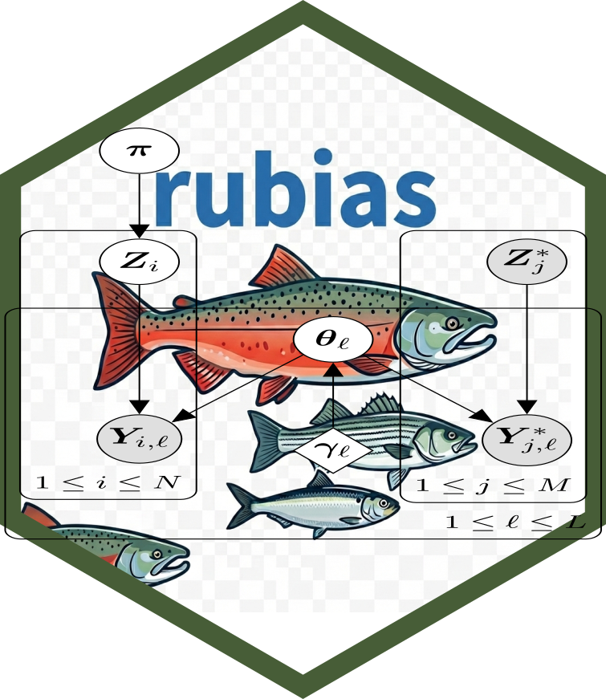

<!-- README.md is generated from README.Rmd. Please edit that file -->

<!-- badges: start -->

[](https://CRAN.R-project.org/package=rubias)
<!-- badges: end -->

# rubias — genetic stock identification (GSI) in the tidyverse 

rubias is an R package for performing genetic stock identification (GSI)
and associated tasks. Additionally, it includes a method designed to
diagnose and correct a bias recently documented in genetic stock
identification. The bias occurs when mixture proportion estimates are
desired for groups of populations (reporting units) and the number of
populations within each reporting unit are uneven.

More recently, the package has been enhanced to:

1.  Allow sampling from the posterior probability of the total catch
    [See
    Vignette](https://eriqande.github.io/rubias/articles/uncertainty-on-total-catch.html)
2.  Provide enhanced tools to understand whether mixing proportions
    $<\frac{1}{N}$ are the result of fish in the mixture that actually
    look like they belong to a certain reporting unit or whether it is
    from the accumulation of a lot of uncertainty. [The
    vignette](https://eriqande.github.io/rubias/docs/articles/ppns-less-than-1-over-n.html)
    about this also suggests a decision-theoretic criterion for
    declaring some such mixture components as empty.

The CRAN version has not kept up with this version on GitHub, primarily
because there is an one chip/compiler combination upon which the
fully-bayesian version code encounters some memory problems. In the
meantime, to install the development version you can simply do:

``` r
remotes::install_github("eriande/rubias")
```

Full pkgdown documentation is now available at
<https://eriqande.github.io/rubias/>.
