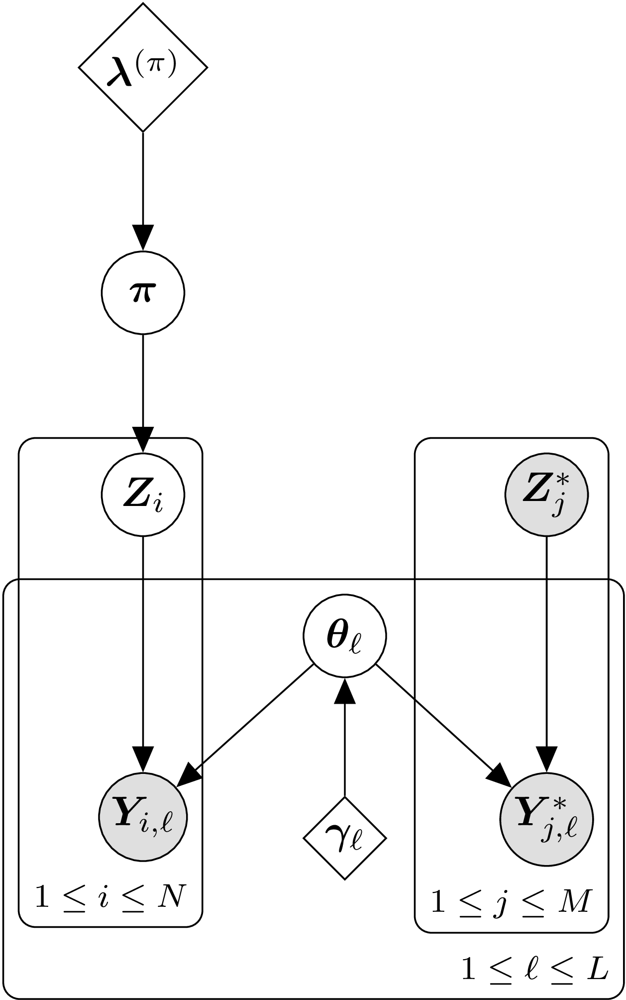
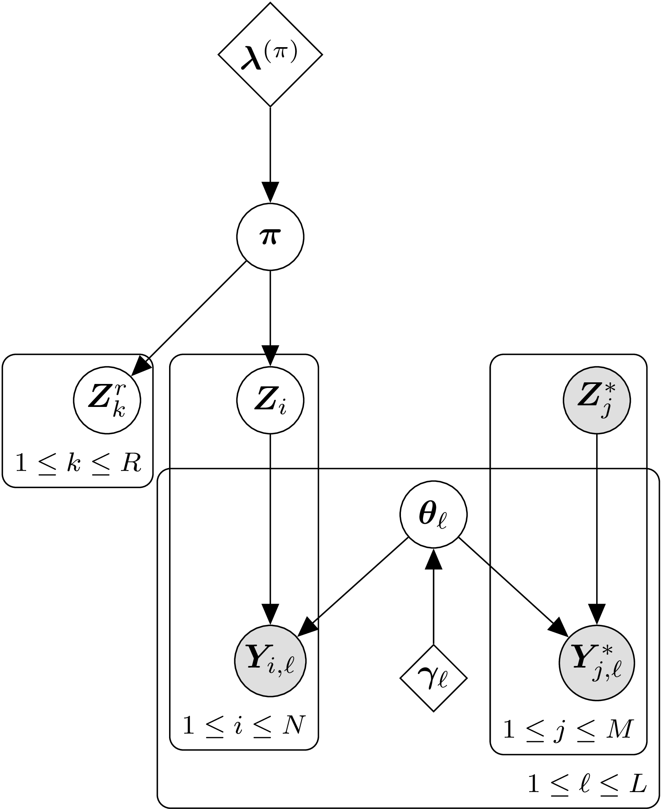

```{r setup, include=FALSE}
library(tidyverse)
```

\newcommand{\bpi}{\boldsymbol{\pi}}
\newcommand{\btheta}{\boldsymbol{\theta}}
\newcommand{\balpha}{\boldsymbol{\alpha}}
\newcommand{\bomega}{\boldsymbol{\omega}}
\newcommand{\blambda}{\boldsymbol{\lambda}}
\newcommand{\bgamma}{\boldsymbol{\gamma}}
\newcommand{\brho}{\boldsymbol{\rho}}
\newcommand{\bphi}{\boldsymbol{\phi}}
\newcommand{\bpsi}{\boldsymbol{\psi}}
\newcommand{\bmu}{\boldsymbol{\mu}}
\newcommand{\bF}{\boldsymbol{F}}
\newcommand{\bW}{\boldsymbol{W}}
\newcommand{\bZ}{\boldsymbol{Z}}
\newcommand{\bY}{\boldsymbol{Y}}
\newcommand{\bV}{\boldsymbol{V}}
\newcommand{\bQ}{\boldsymbol{Q}}
\newcommand{\bR}{\boldsymbol{R}}

\newcommand{\thh}{^\mathrm{th}}


The R package 'rubias,' like most other mixed-stock analysis programs, implements
a typical finite mixture model.  In such a model, a key parameter is the proportion
of different components present in the population from which the samples are being
taken.  We call this parameter $\bpi = (\pi_1,\ldots,\pi_K)$ which includes a proportion
for each of the $K$ components in the mixture.  In the mixed-stock fisheries context,
$\bpi$ holds the stock-specific proportions that are present _in the ocean_ at the
time and location of sampling.  

While $\bpi$ is clearly a necessary variable in a mixture model---it is essential
to model the population proportions---it might not always be the ultimate target
of interest.  A germane example of this occurs when directly managing fisheries using
genetic stock identification (GSI).  In these cases, managers may be particularly
interested in the numbers of fish from different populations or reporting units
that occur in the total catch from a particular fishery (or across multiple fisheries).

Because fisheries might be managed so as to limit the impacts on a particular weak stock
to below a certain threshold, it is important to be able to evaluate the
uncertainty in these estimates of stock-specific total catch.  This
vignette describes how to do that with the newly updated version of 'rubias' that
provides such functionality.  Before describing the details, however, we explain
why propagating the uncertainty found in the Monte
Carlo sample of $\bpi$ does not accurately reflect uncertainty in stock-specific
total catch, and we describe the newly implemented approach in 'rubias' for evaluating
uncertainty in stock-specific total catch in a rigorous way within the
Bayesian framework used by 'rubias.'

## Uncertainty in $\bpi$ is not uncertainty in stock-specific total catch

Although the uncertainty in $\bpi$ can affect the amount of uncertainty
in stock-specific total catch, the two cannot be directly equated because uncertainty
in $\bpi$ always reflects the variability due to having drawn a random sample. By
contrast, the sample itself is a fixed part of the total catch. The implications of
this are easiest to understand when the entire catch has been sampled for GSI.  For,
example, imagine that the total catch was 300 fish, all 300 of those fish are subject
to GSI, and the population of origin of fish from stock $x$ can be identified
with no error using genetics.  If 20 fish originated from stock
$x$, then the total catch from stock $x$ is 20, with no error.  However, the 90%
credible interval on the proportion of fish from stock $x$ in the ocean would
be, from the binomial distribution, (0.043, 0.09).
If this variation were applied to the total catch, it would erroneously suggest
that between 13 and 27 fish from stock $x$ were in the catch, when it is clear that
exactly 20 fish from $x$ were in the catch!

```{r, include=FALSE}
CI <-  qbinom(
  p = c(0.05, 0.95),
  size = 300,
  prob = 20/300
) / 300
```

The above example is simple and contrived.  It serves well to illustrate that
the uncertainty around $\bpi$ cannot be directly used to quantify the uncertainty
in stock-specific total catch.  However, unlike our simple example, stock-specific
total catch will typically be affected by other sources of variation such as
uncertainty in genetic assignment, subsampling of the total catch for genetic
analysis, as well as simply uncertainty in the estimates of the actual total catch.
Fortunately, all of these sources of uncertainty can now be accounted for in a rigorous
way within the Markov Chain Monte Carlo (MCMC) sampling framework of 'rubias,' providing users with an MCMC
sample of the stock-specific total catch for each stock.  This MCMC sample can then
be summarized however desired, or it can be fed into further analyses. The next
section describes the statistical background on how 'rubias' provides an MCMC
sample of the stock-specific total catch.  


## MCMC for stock-specific total catch

```{r standard, echo=FALSE, out.width="30%", fig.align='center', fig.cap="Acyclic directed graph showing the standard conditional GSI model. Diamond nodes are deterministic values used for priors. Circular nodes are variables. The shaded, circular nodes denote variables that are observed and the unshaded circular nodes are variables whose values are updated and sampled during the MCMC process."}
if (knitr::is_latex_output()) {
  knitr::include_graphics("images/standard-model-crop.pdf")
} else {
  
}
```

Figure 1 shows the acyclic directed graph (DAG) used in the conditional
GSI model implemented in 'rubias.'
The stock proportion vector in the ocean, $\bpi$, is visible just below $\blambda^{(\pi)}$, which
is a parameter vector for the prior on $\bpi$.  There are $M$ fish in the reference
baseline data set.
$\bZ^*_j$ is the known origin of fish $j$ in the baseline, while $\bY^*_j$ is its
observed genotype. $\bZ_i$ is an indicator vector giving the unknown origin of the
$i\thh$ fish from the mixture, and $\bY_i$ is the genotype data from that fish, $i$.
$\btheta_\ell$ are the unknown population allele freqeunces at locus $\ell$, and
$\bgamma_\ell$ are the priors on those frequencies.  MCMC
sampling in this model proceeds using Gibbs sampling, with $\bpi$, $\bZ_i$, and
$\btheta_\ell$ being updated during each sweep of the algorithm by drawing each
new value from its full conditional distribution.  (A "sweep" in this context is
a cycle of the MCMC algorithm during which values have been updated for
all the variables in the model.)

```{r stock-spec, echo=FALSE, out.width="42%", fig.align='center', fig.cap="Acyclic directed graph showing the augemented standard conditional GSI model to include additional fish in the catch that were not inlcluded in the GSI analysis."}
if (knitr::is_latex_output()) {
  knitr::include_graphics("images/stock-spec-catch-model-crop.pdf")
} else {
  
}
```


In order to sample from a posterior distribution for the stock-specific total
catch, we introduce the indicator vectors $\bZ^r_k$, $k=1,\ldots,R$, giving
the unknown origin of each of the $R$ fish in the total catch that remain
after the fish used in the GSI analysis are removed from the total catch. The DAG for that model
appears in Figure 2. Sampling in this new model proceeds exactly as before, except
that in every sweep we also simulate values for the $R$ different $\bZ^r_k$ vectors from their
full conditional distribution, which is simply a multinomial sample of size 1 from
cell probabilities that are the current values of $\bpi$:
$$
\bZ^r_k \sim \mathrm{Multinomial}(1, \bpi),~~\mathrm{for}~k=1,\ldots,R.
$$
At the conclusion of each sweep a sample from the posterior distribution of the
stock-specific total catch is obtained by summing over all the $\bZ^r_k$ and
$\bZ_i$ vectors,
$$
C_\mathrm{ss} = \sum_{k=1}^R \bZ^r_k + \sum_{i=1}^N \bZ_i.
$$
In fact, to make things even easier, by definition $\sum_{k=1}^R \bZ^r_k$ is simply
a multinomial random variable of R trials with cell probabilities of $\bpi$.


### Additional Complications

Sometimes, the size of the total catch, $R$, might itself be
estimated with some uncertainty.  So long as the true size of the total catch can be
safely assumed to be conditionally independent of the stock composition given the
estimated total catch, the uncertainty in $R$
can be propagated into the stock-specific total catch by supplying a sample of $R$
from its posterior disribution.  Different values from that posterior sample can be
used for $R$ in each sweep that 'rubias' performs.  This presents no problems, and
the method for doing so is illustrated in the examples below.

Often, the mixed fishery includes commercial or recreational landings, which
are certainly part of the lethal catch or take.  However, in some mixed
stock fisheries, some of the fish sampled and genotyped might be from a test
fishery which is not necessarily lethal, as fish might be returned alive to the
water after being sampled for genetic analysis.  In these cases, fish from the test
fishery might not be considered part of the total catch, and therefore, they
should not contribute to the estimated impacts on any particular stock that they
are assigned to.  In other cases, managers might have an independent estimate
of post-sampling mortality that is not 0.  This can be accommodated, as shown
in the examples in the "Some Genotypes Sampled Might not be Considered Part of the Catch/Mortality" section below.


## Examples

In this section we walk through some simple, hands-on examples.  We will be using
some of the example data that comes with the rubias package. Namely, we are using the
`chinook` reference data set that comprises 91 SNP markers typed on 7,301 fish from
69 collections belonging to 39 different reporting units.  

The samples from the
mixed stock fisheries we will analyze are in the data object `chinook_mix`.  This
data set contains genotypes from 2,256 fish grouped into three different
fisheries ("rec1", "rec2", and "rec3").  (These were not really different
fisheries, but for our purposes, here, we are going to pretend that they
are different fisheries featuring different levels of management information.)
For the most part, the mix of fish found in these fisheries are typical of what
you see of the coast of central and northern California. Most of the fish are
from the Central Valley fall-run stock, and for the purposes today we will
assume that we are particularly interested in impacts on one of the reporting units
less common in these mixtures: "CaliforniaCoast", which are fish from the 
Eel and Russian rivers,listed as Threatened under the U.S. Endanged Species
Act.  


For the purposes of illustration, we will imagine that "rec1" is a recreational
fishery in which every single landed fish is sampled, "rec2" is a fishery in which
an exact 25% of the total catch is sampled and genotyped, and "rec3" is a fishery
from which the managers try to sample 25% of the fish; however the true fraction
sampled varies quite a bit.  Let's imagine that the managers of "rec3" have a
Bayesian method to estimate the true fraction sampled, and that the posterior
for that fraction is a beta distribution with parameters 2 and 6, such that a sample
of that posterior can be obtained like this
```{r, warning=FALSE, message=FALSE}
library(tidyverse)
library(rubias)
set.seed(3)
rec3_tot_catch_sample <- rbeta(5000, 16, 48)
```
And that posterior sample is distributed like this:
```{r}
hist(rec3_tot_catch_sample, breaks = 50)
```

In other words, there is a lot of uncertainty about what the sampling fraction
is, which means there is a lot of uncertainty about what the total catch is
from that "rec3" fishery.

### Using Variability in $\bpi$ 

We will start off with a simple look at how things can go wrong if you use the
variability in $\bpi$ to try to estimate the variability on total catch.  We will
focus on the "rec1" fishery here, in which we are assuming that every single fish
in the catch has been sampled and genotyped.  

First, we analyze just that fishery, and summarise by reporting units.
```{r}
rec1_ests <- chinook_mix %>%
  filter(collection == "rec1") %>%
  infer_mixture(chinook, ., gen_start_col = 5)

# get the mixing proportions trace by repunit
rec1_pi_trace_repu <- rec1_ests$mix_prop_traces %>%
  filter(sweep > 100) %>%
  group_by(sweep, repunit) %>%
  summarise(repunit_pi = sum(pi))

# get the maximum-a-posteriori assignment to repunit
rec1_MAP_repu <- rec1_ests$indiv_posteriors %>%
  group_by(indiv, repunit) %>%
  summarise(repunit_PofZ = sum(PofZ)) %>%
  group_by(indiv) %>%
  filter(repunit_PofZ == max(repunit_PofZ))
```

When we look at the _maximum-a-posteriori_ (MAP) assignments of individuals to
reporting unit, we find 22 fish assigned to the CaliforniaCoast, most of them
with a posterior near 1.0.  Here is the histogram of their posteriors:
```{r}
rec1_MAP_repu %>%
  filter(repunit == "CaliforniaCoast") %>%
  ggplot(aes(x = repunit_PofZ)) +
  geom_histogram(bins = 50) +
  theme_bw()
```


So, it looks like 15 fish are almost certainly from CaliforniaCoast, with another 5 being
very likely from there, and then two of them somewhat likely from there.  In other words,
we are pretty confident that 20 to 22 fish from the CaliforniaCoast are included
in the total catch.  

Let us see what happens if we naively use the estimated proportion of fish from
CaliforniaCoast to try to estimate the number of such fish in the total catch.  Here
is a histogram of the posterior sample of the fraction of fish from CaliforniaCoast in the ocean
from which the catch was taken:
```{r}
rec1_pi_trace_repu %>%
  filter(repunit == "CaliforniaCoast") %>%
  ggplot(aes(x = repunit_pi)) +
  geom_histogram(binwidth = 0.001)
```

And, if we used that fraction to try to estimate the uncertainty around the total
catch of CaliforniaCoast we would greatly overestimate that uncertainty.  By multiplying
the fraction of catch by the total number of fish (which happens to be 743 fish), we
get the posterior for the total catch of CaliforniaCoast:
```{r}
rec1_pi_trace_repu %>%
  filter(repunit == "CaliforniaCoast") %>%
  mutate(Catch_of_CaliforniaCoast = 743 * repunit_pi) %>%
  ggplot(aes(x = Catch_of_CaliforniaCoast)) +
  geom_histogram(binwidth = 1)
```

This is absurd!  On the basis of individual assignments, we are pretty sure that
between 20 and 22 CaliforniaCoast fish were caught, certainly not 14 or 30! This
is why it is important to use the new functionality in 'rubias' to estimate
total stock-specific catch.  We illustrate that in the next two sections.  


### All Fishery Samples are Part of the Catch

We start off with what will likely be the most standard case: the samples have come
from the fishery and all the samples are considered to be part of the impact of the
fishery.  In other words, every fish in the sample of genotypes is considered to be
part of the total catch.  (The next section discusses how to handle departures from
this standard case).

The first thing we must do to estimate the total stock specific catch is to provide
rubias with information about the size of the total catch.  We provide this information
in a tibble with one column `collection` which gives the mixture collection 
("rec1", "rec2", and "rec3" in the current case), and another column, `tot_catch`, 
_which must be a list-column_,
that gives the information about the total catch.  This second column has to be a list
column because we want it to be able to hold a sample from the posterior distribution
for total, aggregate catch.  

In order to make this tibble, we will need to know the
sample sizes from our three fisheries.  They are:
```{r}
chinook_mix %>%
  count(collection)
```

So, given what we described earlier about how the sample size relates to the total
catch, we form the necessary tibble like this:
```{r}
total_catches <- tibble(
  collection = c("rec1", "rec2", "rec3"),
  tot_catch = list(
    743,
    772 / 0.25,
    743 / rec3_tot_catch_sample
  )
)
```

It looks like this:
```{r}
total_catches
```

Then, to get these standard-case total catch estimates from 'rubias' we just need
to pass this tibble into `infer_mixture()` as the `total_catch_tib` parameter.
```{r}
mix_ests_with_catch <- infer_mixture(
  reference = chinook,
  mixture = chinook_mix,
  gen_start_col = 5, 
  total_catch_tib = total_catches
)
```
After that has run, the tibble in `mix_ests_with_catch$stock_specific_total_catch_traces`
holds the posterior sample of the total catch.  It is structured much like the mixing
proportions trace output.  The first few lines look like:
```{r}
mix_ests_with_catch$stock_specific_total_catch_traces
```

The column `SSTC` holds the stock-specific total catch.  

Thus, if we want to see what the posterior distribution for the total catch from the
CaliforniaCoast repunit looks like in each of the three fisheries ("rec1", "rec2", and "rec3")
we just have to:

1. Summarize by reporting unit
2. Filter down to just CaliforniaCoast
3. Discard the burn-in (which we take to be 200 sweeps, here)
4. Plot it

Those steps look like this:
```{r}
CC_sstc <- mix_ests_with_catch$stock_specific_total_catch_traces %>%
  group_by(mixture_collection, sweep, repunit) %>%
  summarise(repunit_sstc = sum(SSTC)) %>%
  filter(sweep > 200, repunit == "CaliforniaCoast")


ggplot(CC_sstc, aes(x = repunit_sstc)) +
  geom_histogram(binwidth = 1) +
  facet_wrap(~mixture_collection, scales = "free")
```

That is just how we expect things to look:

- If we have genotyped the entire catch (as in the "rec1" fishery) then there is
very little variation around the stock specific total catch, especially for a repunit
like CaliforniaCoast that is fairly easily distinguished from the others.
- If we have only genotyped 25% of the catch, there is considerably more variation
in the posterior for stock-specific total catch.  This makes sense---in this case
we are extrapolating the repunit from the mixture proportion ($\bpi$) estimates to
some $772 \times 3 = 2316$ fish.  There will of course be a lot more variation there.
- In the "rec3" fishery, the variability is even greater because there is uncertainty
in the actual fraction of the fishery that was sampled.

It can also be instructive to visualize the total stock-specific catch when it is
decomposed into the two parts of it: 1) the fish that are actually in the genetic
sample, and 2) the additional fish (if any) that are part of the catch but not the
genetic sample.  This is fairly easy---the return object has not just
`stock_specific_total_catch_traces`, but also:

- `allocation_count_traces`: the counts of fish in the mixture that are allocated
  to the catch each iteration.
- `posterior_predictive_remaining_catch_traces`: the counts of fish sampled from the
  posterior predictive distribution to account for the total catch.


We can pick those out and plot them with the total catch to confirm things are
working the way that they should.
```{r}
CC_pprc <- mix_ests_with_catch$posterior_predictive_remaining_catch_traces %>%
  group_by(mixture_collection, sweep, repunit) %>%
  summarise(repunit_pprc = sum(PPRC)) %>%   # column PPRC has the posterior_predictive_remaining_catch
  filter(sweep > 200, repunit == "CaliforniaCoast")

CC_ac <- mix_ests_with_catch$allocation_count_traces %>%
  group_by(mixture_collection, sweep, repunit) %>%
  summarise(repunit_ac = sum(CA)) %>%  # column CA has the allocation_count
  filter(sweep > 200, repunit == "CaliforniaCoast")

# then join those to the total stock-specific catch and pivot them
three_counts <- CC_sstc %>%
  left_join(CC_pprc, by = join_by(mixture_collection, sweep, repunit)) %>%
  left_join(CC_ac, by = join_by(mixture_collection, sweep, repunit)) %>%
  pivot_longer(cols = repunit_sstc:repunit_ac, names_to = "count_type", values_to = "n")
```

We can plot those all together like this:
```{r}
ggplot(three_counts, aes(x = n, fill = count_type)) +
  geom_histogram(binwidth = 1) +
  facet_grid(count_type ~ mixture_collection, scales = "free")
```

It is worth taking the time to confirm for yourself that these results are
exactly as expected, given how the scenarios were designed.

### Some Genotypes Sampled Might not be Considered Part of the Catch/Mortality

There might be times when there is a test fishery that is going on concomitant
with the retention fishery.  And genotypes from these different fisheries might
all end up together as a sample from the mixed fishery at a certain time and place.
If it is the case that fish from the test fishery are released after sampling,
then it might be appropriate to _not_ treat those fish as catches.  Certainly if
they survive the sampling process with no adverse impacts, one would not want to
count them as part of the catch.  It is, however, conceivable that there is some
mortality associated with the test fishery, and in that case, it might be appropriate
to treat the fish that died due to participating in the test fishery as part of
the catch.  It might be the case that when tissues are taken from the test fishery,
a score is assigned to each fish rating the injuries they received---and hence the
likelihood that they might die after release.  

Rubias has a simple way of handling all these cases.  Essentially, each fish in the
mixture is assigned a value between 0 and 1, incluside, in an additional column (which 
must appear before the
start of the genotype columns) called `prob_is_catch`.  That is short for "the probability
this fish is considered to be part of the catch."  A value of 1 means that the fish
is part of the catch.  A value of 0 means that the fish is certainly _not_ to be
considered as part of the catch.  And a value of $p$ that is between 0 and 1 means
that the fish had a probability $p$ of dying after sampling, and if it did die, then
it should be considered part of the catch.  

In the previous section, **All Fishery Samples are Part of the Catch**, we saw the
simple case where each fish in the mixture has `prob_is_catch` = 1.  That is the
default situation: unless otherwise
specified, every fish in a mixture is considered to be part of the catch.  However,
if you supply the option `variable_prob_is_catch = TRUE` to the `infer_mixture()`
function, then that function will require that there is a `prob_is_catch` column,
and it will use the values within it to account for
fish from test samples that might not be considered part of the catch. 

We will make up some data here to illustrate different scenarios.  We will imagine
that:

- Of the 743 "rec1" fishery samples, the first 300 of them were from a test fishery
  that is believed to have zero mortality, and should not be considered part of the
  catch.
- All the 772 "rec2" fishery samples were taken in a test fishery where it is well
  known that fish are handled roughly.  On average, 1/5 of those released  have a 50% chance of
  dying as a result of that treatment, and
  1/5 of the individuals have a 40, 30, 20, and 10% chance of dying and being
  part of the catch, respectively, as well (this is obviously just for illustration!)
- All the "rec3" fish are considered to be part of the catch.

We can modify the chinook_mix data set to have a `prob_is_catch` column that
reflects this:
```{r}
chinook_mix_with_probs <- chinook_mix %>%
  group_by(collection) %>%
  mutate(
    prob_is_catch = case_when(
      collection == "rec1" & (1:n()) <= 300 ~ 0,
      collection == "rec1" & (1:n()) > 300 ~ 1,
      collection == "rec2" ~ sample(c(0.5, 0.4, 0.3, 0.2, 0.1), n(), replace = TRUE),
      collection == "rec3" ~ 1
    ),
    .after = indiv
  ) %>%
  ungroup()
```

Let's just verify that this was done correctly by counting up the occurrences
of different `prob_is_catch` values:
```{r}
chinook_mix_with_probs %>%
  count(collection, prob_is_catch)
```

That looks pretty good!

One little gotcha here before we pass that off to `infer_mixture()` is with the
`variable_prob_is_catch = TRUE` is that the reference data set and the mixture data
set must all have the same columns.  So we need to add the same column to the reference
data set `chinook`.  We will simply put a column of 0's in there.  (We could have used
NA's as well, but I think we have to be careful to make sure they are NA_real's.  It
is simpler to just put numeric values in there---they don't get used in any way...)
```{r}
new_reference <- chinook %>%
  mutate(prob_is_catch = 0.0, .after = indiv)
```

Now, the genotype data start in the 6th column.  If we run this without the
`variable_prob_is_catch = TRUE` option, then we will get just what we got
before, because `infer_mixture()` will not use the `prob_is_catch` column.
However, when we do include the `variable_prob_is_catch = TRUE` option,
then the `infer_mixture()` function is going to look for and use the
information in the `prob_is_catch` column.  
```{r}
catch_ests_with_var <- infer_mixture(
  reference = new_reference,
  mixture = chinook_mix_with_probs,
  gen_start_col = 6,
  total_catch_tib = total_catches,
  variable_prob_is_catch = TRUE
)
```

Let us now look at the resulting numbers, paying careful attention to "rec1",
which is particularly illuminating.
Because the total catch is the same as before (743), but 300
of the mixture sample are _not_ part of the catch, then there is more variation
in the total catch than before.
```{r}
CC_sstc_var <- catch_ests_with_var$stock_specific_total_catch_traces %>%
  group_by(mixture_collection, sweep, repunit) %>%
  summarise(repunit_sstc = sum(SSTC)) %>%
  filter(sweep > 200, repunit == "CaliforniaCoast")

CC_pprc_var <- catch_ests_with_var$posterior_predictive_remaining_catch_traces %>%
  group_by(mixture_collection, sweep, repunit) %>%
  summarise(repunit_pprc = sum(PPRC)) %>%   # column PPRC has the posterior_predictive_remaining_catch
  filter(sweep > 200, repunit == "CaliforniaCoast")

CC_ac_var <- catch_ests_with_var$allocation_count_traces %>%
  group_by(mixture_collection, sweep, repunit) %>%
  summarise(repunit_ac = sum(CA)) %>%  # column CA has the allocation_count
  filter(sweep > 200, repunit == "CaliforniaCoast")

# then join those to the total stock-specific catch and pivot them
three_counts_var <- CC_sstc_var %>%
  left_join(CC_pprc_var, by = join_by(mixture_collection, sweep, repunit)) %>%
  left_join(CC_ac_var, by = join_by(mixture_collection, sweep, repunit)) %>%
  pivot_longer(cols = repunit_sstc:repunit_ac, names_to = "count_type", values_to = "n")

ggplot(three_counts_var, aes(x = n, fill = count_type)) +
  geom_histogram(binwidth = 1) +
  facet_grid(count_type ~ mixture_collection, scales = "free")
```

That all checks out!


## Notes:

1. I still need to implement this for the BR (Bayesian Resampling) method.
That should be relatively straigtforward. The difficult book-keeping parts have
been done and now it is a matter of adding a few pieces of code around line
213 in rcpp_fullBayes_mcmc.cpp.
     * We don't need to do SSTC sampling for the preliminary steps in the BR method.
2. The variable mortality rates (the probability with which individuals in the
sample are included in the total catch or not---to accommodate test fishery fish, etc.)
is not yet implemented, but will be pretty quick. I've done everything else with
a mind to implementing that easily.  
3. This is currently passing all CRAN checks so that it should be pretty quick to
get it up on CRAN.  
